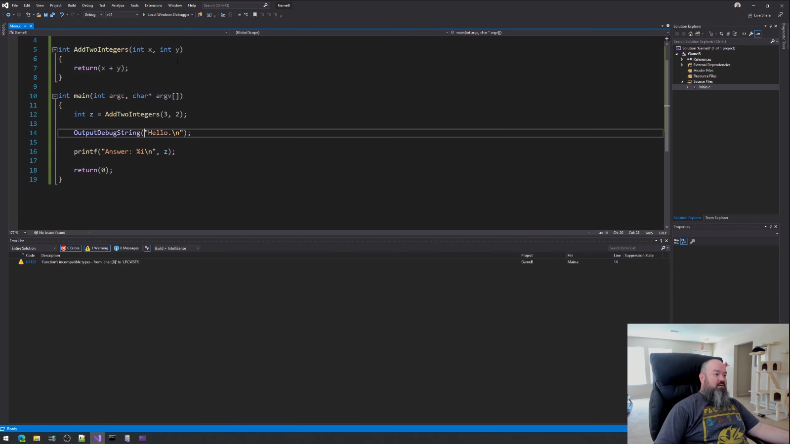
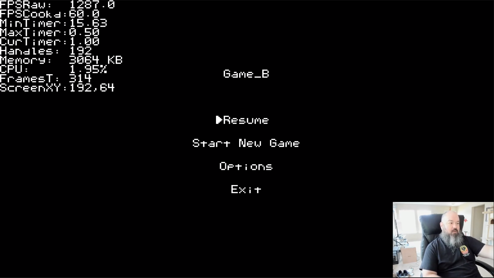
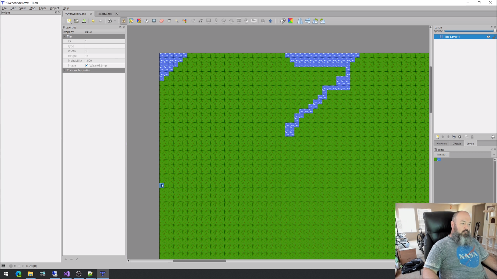
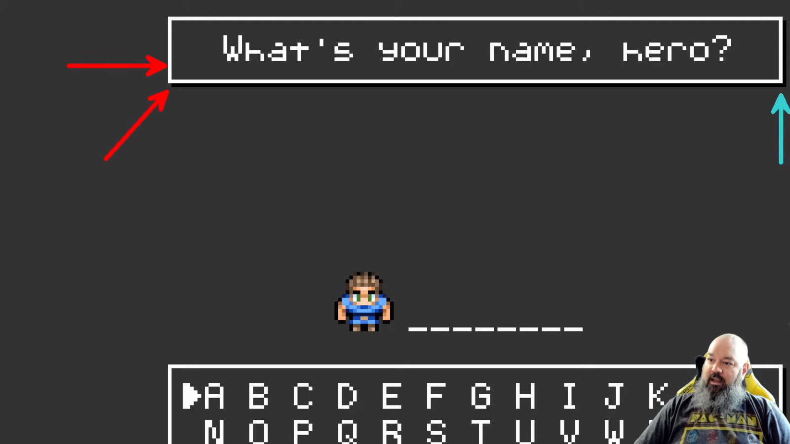
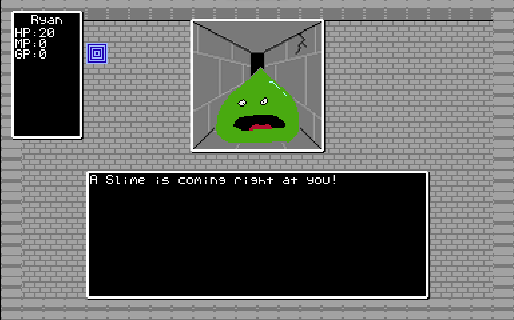

# GameB

Watch the series on YouTube [here.](https://www.youtube.com/playlist?list=PLlaINRtydtNWuRfd4Ra3KeD6L9FP_tDE7)

We are going to make a retro-style video game from scratch, using the C programming language.
 
This source code repository is companion material to go along with my video series on YouTube.

If you've ever wanted to get into programming, even if you have no coding experience, well... you could start here.

Watch the series on YouTube [here.](https://www.youtube.com/playlist?list=PLlaINRtydtNWuRfd4Ra3KeD6L9FP_tDE7)
 
Follow me on Twitter @JosephRyanRies
 

# Build Instructions
--------------------
The batch file named CopyAssets.bat creates a compressed archive of assets named Assets.dat using the assets
stored in the .\Assets directory. The Assets.dat file needs to reside in the same directory as the game executable.
If you run the game from the Visual Studio debugger, the working directory of the game will be the same directory
as the Visual Studio solution. But if you run the game normally, outside of the debugger, the working directory
will be the same directory as the game's executable.

There is also an environment variable you should create.
The environment variable is called GAMEBDIR and it should point to the fully-qualified path to the project on your machine.
You can use the setx utility to create this environment variable. For example:

`C:\>setx GAMEBDIR C:\Users\ryanr\source\repos\GameB`

`SUCCESS: Specified value was saved.`

`GAMEBDIR=C:\Users\ryanr\source\repos\GameB`

If you are using the Clang compiler,  build with the included clang_*.bat batch scripts.

# Tools
--------
Some extra tools used to help create this game:

(These are all 3rd party tools I bear no responsibility for and have no control over.)

- [Paint.NET](https://www.getpaint.net/)

- [32bpp bmpx extension for Paint.NET](https://forums.getpaint.net/topic/11201-alpha-32bits-bitmap-support-for-paintnet/#entry308033)

- [Tiled](https://www.mapeditor.org/)

- [Audacity](https://www.audacityteam.org/)

- [ASCIIFlow](https://asciiflow.com/#/)

- [BFXer](https://www.bfxr.net/)

- [Aseprite](https://www.aseprite.org/)

- [Clang](https://github.com/llvm/llvm-project/releases/)

- [WinDbgX](https://www.microsoft.com/en-us/p/windbg-preview/9pgjgd53tn86)

- [Procdump](https://live.sysinternals.com)

- [Process Monitor](https://live.sysinternals.com)

- [Process Explorer](https://live.sysinternals.com)

- [Notepad++](https://notepad-plus-plus.org/)

 
# License
----------
The source code in this project is licensed under the MIT license.
The media assets such as artwork, custom fonts, music and sound effects are licensed under a separate license.
A copy of that license can be found in the 'Assets' directory.
stb_vorbis by Sean Barrett is public domain and a copy of its license can be found in the stb_vorbis.c file.
miniz by Rich Geldreich <richgel99@gmail.com> is public domain (or possibly MIT licensed) and a copy of its license can be found in the miniz.c file.